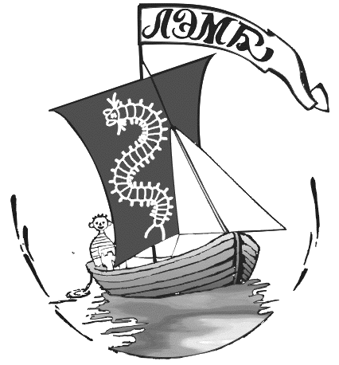

 
```{r setup, include=FALSE}
knitr::opts_chunk$set(echo = TRUE)
```

<style type="text/css">

body{ /* Normal  */
      font-size: 18px;
  }
td {  /* Table  */
  font-size: 8px;
}
h1.title {
  font-size: 60px;
  color: DarkRed;
}
h1 { /* Header 1 */
  font-size: 30px;
  color: black;
}
h2 { /* Header 2 */
    font-size: 20px;
  color: black;
}
h3 { /* Header 3 */
  font-size: 20px;
  font-family: "Times New Roman", Times, serif;
  color: black;
}
code.r{ /* Code block */
    font-size: 12px;
}
pre { /* Code block - determines code spacing between lines */
    font-size: 14px;
}
</style>




<font color='red'>
**Внимание!** Нажимая на ссылку **"Видео"**, вы скачиваете очень большой файл. 
</font>.


# **Материалы онлайн занятий 2020-2021 учебного года**

## **Тематические онлайн занятия**


### **Онлайн-встречи по теме** **"Зоология беспозвоночных" Первый год изучения** 

- [***Многообразие протист*** Презентация](https://drive.google.com/file/d/1nnH554uwYvTkurUz3GpxGu09Ra5De3k8/view?usp=sharing)    


- [***Строение клеток протист*** Видео](https://drive.google.com/file/d/16kasWrIHc6F7CevhbcsMxwAET7sraeK0/view?usp=sharing)
[Презентация](Presentations/VM_1st_year/Клетки протистов.pptx)


- [***Устройство эукариотической клетки*** (читает ДА). Видео](http://hydrola.ru/smth/da/distant/Cell_DA.mp4)

- [***Жизненные циклы протист*** (читает ВМ). Видео. ](https://drive.google.com/file/d/1uEAG46zzKd8P7sghuYMLMlOq-i1ar9dw/view?usp=sharing)
[Презентация](Presentations/VM_1st_year/Жизненный цикл Protista.pptx)


- [***Происхождение многоклеточных животных*** (читает ВМ). Видео. ](https://drive.google.com/file/d/1BN_GYqBzSArHQV7IxI7UJ8dM-qLXmw53/view?usp=sharing)
[Презентация](https://drive.google.com/file/d/148e7NWQvFr1hH-as-KkPzCZz1EDdThFT/view?usp=sharing)

- [***Губки*** (читает ВМ). Видео. ]()
[Презентация](https://drive.google.com/file/d/1ks5gwdI0PNx7oEYK7KhAmU96WK9X87jG/view?usp=sharing)

- [**Глоссарий по темам "Основы систематики", "Строение эукариотической клетки", "Protista", "жизненные циклы протистов"** Для подготовки к зачету](Presentations/VM_1st_year/TERMS Zoology first part.pdf)

- [**А вот и сам зачет**](https://docs.google.com/forms/d/e/1FAIpQLSdU_qRIZI75Vd_GVHW98kVq753uac8pvtpQ50bRCumPiXoG1g/viewform?usp=sf_link). Можно его пройти. Правда, результаты придется получать в частном порядке (можно написать ВМ письмо с просьбой прислать результат). Рекомендуется пройти его еще раз и тем, кто сдавал его вместе со всеми.

- [**Митоз, Мейоз, Бесполое и половое размножение** (Читает ДА) Видео часть 1](http://hydrola.ru/smth/da/distant/1y_11_12_20_1part.mp4) [Видео часть 2](http://hydrola.ru/smth/da/distant/1y_11_12_20_2part.mp4)

- [**Placozoa. Презентация**](https://drive.google.com/file/d/11KlgQ9R4aTnuZJdKspFINV16x2faMAPt/view?usp=sharing)

- [**Cnidaria. Презентация Часть 1.**](https://drive.google.com/file/d/1WPWwUXm0X6OfPQTQvhorWB3UqiXU9-vc/view?usp=sharing)

- [**Видео. Placozoa. Cnidaria. Рассказывает ВМ**](https://drive.google.com/file/d/1gdmw1mYMYhgFs9aBxlQSq8T0HMW_GMVh/view?usp=sharing)

+ [**Видео. Разнообразие насекомых. Рассказывает ДА**](http://hydrola.ru/smth/da/distant/2y_17_11_20.mp4)

+ [**Амебоидные протисты. Видео. Рассказывает ДА.**](http://hydrola.ru/smth/da/distant/1y_18_12_20.mp4)


+ [**Кишечнополостные. Практическая работа.**](Presentations/Virtual_Practice/Cnidaria практика_VM.pptx)


<br>
<br>

### **Онлайн-встречи по теме** **"Зоология беспозвоночных" Второй год изучения** 

- [**"Жизненные циклы нематод"** Презентация](Presentations/VM_1st_year/Life_cycles_Nematoda_VM.pptx) [Видео](https://drive.google.com/file/d/1zdGqR1KC0DO5oF1JnrrH518_uXaoAY6F/view?usp=sharing)


- [**"Головохоботные черви"** Презентация](Presentations/VM_2nd_year/Scalidophora.pptx) [Видео](https://drive.google.com/file/d/1nUct7-fm9krgiqg8rn98UuJbbLxScG_0/view?usp=sharing)

- [**"Ракообразные. Часть 1."** Презентация](https://drive.google.com/file/d/1G6vKfMd2fDUzNT4JdZ4nLMWuS43mPvFA/view?usp=sharing) [Видео](https://drive.google.com/file/d/1B2QQvjP9fuHLzOBZaGxj978X2JvbeIPA/view?usp=sharing)

- [**"Ракообразные. Часть 2."** Презентация "Конечности речного рака"](Presentations/VM_2nd_year/Рак и Таракан внешняя морфология.pdf)

*Домашнее задание* Ваше домашнее задание заключается в том, чтобы самостоятельно разобраться с внешней морфологией раков. Для этого вам нужно будет купить в магазине "OKей" речного рака. 

<font color='red'>

**Внимание!**      
Раки в магазине "ОКей" продаются **живыми**, увы. Вообще-то это еда и мало у кого получается съесть животное и не навредить ему. Поэтому раков придется предварительно умертвить. Гуманно это сделать можно, положив покупку на сутки в *морозилку*. Если вам это сделать не позволяют принципы или иные ограничения, то тогда можно купить мороженных креветок и работать с ними (они мелкие, но их строение такое же как и у речного рака). Если и это претит вашим принципам, то можете найти в интернете изображения и поработать с ними.

</font>


При работе с объектом (рак, креветка или изображение) надо найти и сфоткать на смартфон (ну или фотоаппарат в режиме *макро*) внешний вид животного. Подписать на объекте тагмы. Потом отделить и сфотографировать  А1, А2, ротовые конечности (Md, Mx1, Mx2, Mxp1, Mxp2, Mxp3), одну из ходных ног, одну из плеопод и уроподу. Фотки надо соединить в одну презентацию и присылать ее на адрес ВМ до 23:59 дня, накануне следующего занятия. 

+ [**Рисунки с лекции про внешнее строение насекомых**](Presentations/VM_2nd_year/Insecta/Insecta.zip) [Видео. Рассказывает ВМ.](https://drive.google.com/file/d/1flq8Obi6EhtSGEBNw6gGifR7qm-_ur8w/view?usp=sharing)

+ [**Насекомые. Практическая работа**](Presentations/Virtual_Practice/Insecta практика_VM.pptx)

- [**Видео. Внутреннее строение аннелид. Рассказывает ДА**](https://us02web.zoom.us/rec/share/C4vpCfn3ybhZC3myLGB7Bkkgl2rEFxwyD2wDAFST7DEps1jgdP7XBt3478cm5HNN.lHk6V_6PkT2u-zIS?startTime=1607436405000)

- [**Видео. Размножение и развитие аннелид. Рассказывает ДА**](https://us02web.zoom.us/rec/share/mlb7DfF0TonYbj0oBjiEkrqf11FPN6DJlnPthKcmnKetvTQxw9yoDg02WUxxsqdE.J5pQsiUP4oKO5APM?startTime=1608040589000)


+ [**Размножение и развитие кольчатых червей. Видео. Рассказывает ДА**](http://hydrola.ru/smth/da/distant/2y_15_12_20.mp4)

<br>
<br>

### **Онлайн-встречи по теме** **"Эволюция целовека"** 

- [Половой отбор](https://drive.google.com/file/d/1SPebmaY34JYEmdjttu0bIdtIPUQGSeUb/view?usp=sharing)

- [Первые находки ископаемых гоминид](https://drive.google.com/file/d/1zdGqR1KC0DO5oF1JnrrH518_uXaoAY6F/view?usp=sharing) 

- [Происхождение бипедии. Австралопитеки. Видео](https://drive.google.com/file/d/1ZRp0AL8Rtn4s6hP7n_XzuNdVWoaeN6BT/view?usp=sharing) [Презентация](https://drive.google.com/file/d/18TppcN2Igqe8nLNVawvkQ34GB2ZNIg2g/view?usp=sharing)

- [Ранние люди. Окончательное решение неандертальского вопроса](https://drive.google.com/file/d/18-feaGJRhVtUzxIstXS8NBfH-IY96mwG/view?usp=sharing) [Презентация](https://drive.google.com/file/d/1q688G3gRW_0RHaXKRmqX032UbAEKrfA6/view?usp=sharing)

- [**А вот и зачет**](https://docs.google.com/forms/d/e/1FAIpQLSdU_qRIZI75Vd_GVHW98kVq753uac8pvtpQ50bRCumPiXoG1g/viewform?usp=sf_link). Можно его пройти *еще раз*. Защитаем самый лучший ответ! 

<br>
<br>


### **Онлайн-встречи по теме** **Зоология Позвоночных"** 

- [Бесчерепные. Перзентация](https://drive.google.com/file/d/1wRLNhqwIsAnVb0B50hHKSqxLVf7JiXWi/view?usp=sharing) [Видео. Расскзывает ВС](https://drive.google.com/file/d/1AEC7QEom1iImgAi5ELEO2iN9NYfHCGZt/view?usp=sharing)


- [Круглоротые. Перзентация](https://drive.google.com/file/d/1flq8Obi6EhtSGEBNw6gGifR7qm-_ur8w/view?usp=sharing) [Видео. Рассказывает ВС](https://drive.google.com/file/d/1flq8Obi6EhtSGEBNw6gGifR7qm-_ur8w/view?usp=sharing)


<br>
<br>

### **Общие сборы и семинары**

[Общий сбор 12.11.2020 перед переходом на дистанционное обучение](https://drive.google.com/file/d/1X46Fy7R0DgHSAj2HiN4Fm_2PT-6REMU5/view?usp=sharing)

[Выборы в члены Лаборатории. 14.11.20](https://drive.google.com/file/d/1Y2xzFxFEQKcCKjqzDC0wDvCqpoo9Dtc1/view?usp=sharing)

<br>
<br>

### **Онлайн развлечения**

- [Что? Где? Когда? В роли крупье Константин Галиевский](https://drive.google.com/file/d/1r1pMSX-Hi5L78yuyZVBSBLZxDg1uc1Bc/view?usp=sharing)

- **Изба-читальня в нашем скайп-канале**. По вторникам и субботам читаем книжечки. Те, кто пропустил, могут послушать записи, которые какое-то время еще будут лежать в чате скайпа.  


<br>
<br>

### Курс ***Выполнение самостоятельной исследовательской работы*** 

В курсе «Выполнение самостоятельной исследовательской работы» вам предстоит войти в виртуальный научный коллектив, который совместно будет решать научную задачу. Вам нужно будет просматривать видеоматериалы и выполнять задания. Видео и задания будут появляться в доступе по мере развития нашего исследования. 

Видеоматериалы будут двух типов: **1.** небольшие лекции по организации научного исследования (их будет читать Дмитрий Алексеевич Аристов) и **2.** материалы, посвященные собственно виртуальному исследованию (их будет сопровождать Вадим Михайлович Хайтов).


+ Лекция  [Что такое наука?](https://youtu.be/cFzBiCRw3ZQ)

В качестве упражнения в применении научного метода мы с вами проведем небольшое исследование, связанное с загадкой, которую мы пытаемся решить уже несколько лет. 

Честное слово, мы не знаем отгадки и очень надеемся, что найдем ее вместе с участниками этой программы. 


**Начало виртуального исследования**

О чем это исследование.
Основное место научно-исследовательской работы Лаборатории экологии морского бентоса (гидробиологии) - это Белое море. Мы работаем в Кандалакшском заповеднике, на острове Ряжков. Именно здесь мы обнаружили странное явление, изучению которого и будет посвящена наша виртуальная исследовательская работа. Посмотрите небольшой [видео-фрагмент](https://youtu.be/cHFH9JUKkgo), в котором вы увидите то, что мы будем исследовать. 


Этот фрагмент - часть более большого проекта, который мы назвали «Заповедный детектив», с материалами которого вы  можете познакомиться вот [здесь](https://www.youtube.com/channel/UCe0BhSVTL-6N046patfGCuw/playlists?view_as=subscriber).

А вот, собственно, и задача, которую мы будем решать: [**Загадка гагаямы**](https://youtu.be/ogdEdXtDp0s).

Внимание! Поскольку работа по исследованию загадки гагаямы требует некоторых знаний, касающихся Белого моря, где, собственно, и будут разворачиваться исследования, то крайне рекомендуется познакомится с материалами курса «Прогулки по дну моря», которые приведены на вот этом  [**yutube-канале**](https://www.youtube.com/channel/UCe0BhSVTL-6N046patfGCuw/playlists?view_as=subscriber). Особое внимание уделите **прогулкам №3 и №4**, где рассказывается о литорали, где и будет разворачиваться наше исследование. 
   

+ [Гугл-форма для формулировки гипотез о загадке гагаямы](https://docs.google.com/forms/d/e/1FAIpQLSfuVFyW78UtLhXHbEVea7jprnb79P9yIY9dKHFBVNdA8jZiMA/viewform?usp=sf_link)


**Какие бывают научные исследования?**

+ [Какие бывают научные исследования?](https://youtu.be/T7i9qeg52M4)

+ [Гипотезы о гагаямах](https://youtu.be/O_hrP58JR1c)

<br>

**Работа с  научной литературой** 

+ [Работа с научной литературой](https://youtu.be/qWBSOOh2V2Y)

+ [Работаем с гипотезами. Часть 1](https://youtu.be/MTr1ifhtGGs)


+ [Google-фома для выполненения задания](https://docs.google.com/forms/d/e/1FAIpQLSdhFT87kdTNaNRPKB7-ep6zmybwY_AwP1WOmLXsj1Z9EWAkNQ/viewform?usp=sf_link)

Внимание!    
Для выполнения задания вам потребуется поискать информацию, в том числе, и на английском языке. К этому надо привыкать! Не стесняйтесь пользоваться словарями и прочими переводчиками. Самое главное - это найти информацию.


<br>

**Уважаемые члены нашего виртуального научного коллектива!**


А вот небольшой рассказ о том, как можно и нужно было бы разбираться с тем множеством гипотез, которые мы сформулировали.

+ [Работаем с гипотезами. Часть 2](https://youtu.be/XQF96EX15ew)

+ [Работаем с гипотезами. Часть 3](https://youtu.be/nTfO3Cr-h_w)


Многие из вас хорошо поработали и нашли информацию о ямках на дне моря. 

Вашему вниманию представляется небольшой мастер класс, в котором рассказывается о том, как ищется информация.


+ [Мастер-класс по поиску информации о рыбах, роющих гагаямы](https://youtu.be/_z76cxa0wyk)

+ [Как устроена научная статья и как ее читать](https://youtu.be/rSN6NeebTUs)


**Задание на описание дизайна эксперимента**

Теперь вам нужно продумать дизайн эксперимента (что и как будем делать в соответствии с той схемой, которую мы обсуждали) для проверки гипотезы о том, что гагаямы могут появляться в результате формирования областей с пониженной плотностью в толще грунта.

Для продумывания дизайна эксперимента помните, что планирование экспериментального исследования всегда включает в себя следующие пункты:

1. Что будем измерять (что будет величиной которая отражает поведение нашей системы).
2. Что будет экспериментальным воздействием и что будет контролем.
3. Как будет устроена рандомизация.
4. Каковы морально-этические издержки эксперимента.
5. Каковы экономические издержки эксперимента.
6. Как будут устроены ПОВТОРНОСТИ.

Для ответа заполните вот эту [гугл-форму](https://docs.google.com/forms/d/e/1FAIpQLScl5bcGQr6q2Y4gLsXtXAt4YL8qrHjjxOBB4dKJI1dDybMiZw/viewform?usp=sf_link) 


**"Первичные данные и что делать с ними дальше"**

Уважаемые члены нашего виртуального научного коллектива!  В предложенной серии видео вы сможете посмотреть на то как регистрируются первичные данные и про то как их можно хранить.

+ [Первичная регистраця данных: Вводное слово](https://youtu.be/H2vkgmdUqfY)
+ [Секреты первичной регистрации данных](https://youtu.be/wwnl4r-H7RU)
+ [Работаем с полевыми дневниками](https://youtu.be/aWATR1pqtJU)
+ [База данных, как минимальный вклад в науку](https://youtu.be/H2vkgmdUqfY)
+ [Создание простейших баз данных](https://youtu.be/V8A6x19iVJs)


**Задание**
Вам нужно будет раскритиковать записи, сделанные в процессе поведения исследования плотности грунта в районе гагаям. Для того, чтобы понимать что и как измеряли, посмотрите вот это видео.

+ [Не все приборы можно купить... Как измерить плотость грунта с помощью самодельного прибора](https://youtu.be/aLiZIw-FNkY)


Посмотрев это видео, вы должны будете ознакомиться со следующей  презентацией. 
[Презентация с данными из полевых дневников](Presentations/Scientific work/Результаты полевых наблюдений.pdf)

Просмотрите внимательно страницы полевого дневника, которые приведены в этой презентации, и напишите, что **было сделано плохо**. В чем недостатки этой записи. Для ответа используйте вот эту [гугл-форму.](https://docs.google.com/forms/d/e/1FAIpQLSeoL1Q1iQea1dxLefpBvcyiXoo5ltIrLkXyiaQc8bWIOF1u6A/viewform?usp=sf_link)


<!-- **Задание**.  -->


<br>
<br>
<br>


# ***Материалы онлайн занятий 2019-2020 учебного года. Календарный каталог ***
<!-- +++++++++++++++++++++++++++++++++++++++++++++++++++++++++++ -->
<!-- Ниже до "тематического каталога" представлена полная х-ня  -->


[**Дистанционные занятия весной 2020 г.**](Distant_Spring_2020.html)


<br>
<br>
<br>


# ***Тематический каталог онлайн занятий 2019-2020 учебного года***


<!-- +++++++++++++++++++++++++++++++++++++++++++++++++++++++++ -->

<!-- ЧЕстные занятия -->
<!-- ++++++++++++++++++++++++++++++++++++++++++++++++++++++++++++ -->

## **Зоология беспозвоночных первый год изучения** (ведущий В. М. Хайтов)
# **Зоология беспозвоночных первый год изучения** (ведущий В. М. Хайтов)

+ Онлайн-встреча по теме ***Многообразие протист***
[Презентация](https://drive.google.com/file/d/1nnH554uwYvTkurUz3GpxGu09Ra5De3k8/view?usp=sharing)

+ [Сосальщики (Trematoda)](Presentations/VM_1st_year/Trematoda_VM.pptx)

+ [Ленточные черви (Cestoda)](Presentations/VM_1st_year/Cestoda_VM.pptx) [**Видео**](https://drive.google.com/open?id=1nW0zdI-MbpUvRV_6Q3P0ZravdSxv1kYf)

+ [Мелкие группы плоских червей (Aspidogastrea, Monogenoidea, "Cestodaria")](Presentations/VM_1st_year/Aspidogastrea Monogenea Cestodaria_VM.pptx) [**Видео**](https://drive.google.com/open?id=1_bxNBKGTocYFl1ZXulYaMl6_c9RR3gJ6)

+ [Планы строения животных: Эволюцилнная инженерия](Presentations/VM_1st_year/Планы строения животных_VM.pptx) [**Видео**](https://drive.google.com/open?id=1jd0dWLxnJtjbR59RDch4qxgkaV922SHL)

+ [Круглые черви (Nematoda): Строение](Presentations/VM_1st_year/Nematoda_VM.pptx) [**Видео**](https://drive.google.com/open?id=1qRCR-smQ_HwJEeNkdhH2AU9xWv0l_SeT)

+ [Круглые черви (Nematoda): Жизненные циклы](Presentations/VM_1st_year/Life_cycles_Nematoda_VM.pptx) [**Видео**](https://drive.google.com/open?id=1aMlLpiXeV1_tyew75krHd_QZ2yBlg_IX)


# **Зоология беспозвоночных первый год изучения** (ведущий А. В. Полоскин)

+ [Амебы](Presentations/AV_1st_year/Amoebozea.pdf)
+ [Excavata и Choanoflagellata](Presentations/AV_1st_year/Excavata_Choanoflagellata.pdf)
+ [Rhizaria](Presentations/AV_1st_year/Rhizaria.pdf)
+ [Жизненные циклы споровиков часть 1](Presentations/AV_1st_year/Жизненные_ циклы_споровиков.pdf)
+ [Жизненные циклы споровиков часть 2](Presentations/AV_1st_year/Жизненные_ циклы_споровиков2.pdf)
+ [Малярия](Presentations/AV_1st_year/Малярия_.pdf)
+ [Stramenopiles и Microsporidia](Presentations/AV_1st_year/разножгутиковые_микроспоридии.pdf)
+ [Фотосинтезирующие жгутиконосцы](Presentations/AV_1st_year/фотосинтезирующие_жгутиконосцы.pdf)


# **Зоология беспозвоночных второй год изучения** (ведущий В. М. Хайтов)

+ [Планы строения животных: Эволюционная инженерия](Presentations/VM_1st_year/Планы строения животных_VM.pptx)

+ [Полихеты](Presentations/VM_2nd_year/Polychaeta.ppt)

+ [План строения аннелид. Развитие полихет](Presentations/VM_2nd_year/План строения Annelida развитие Polychaeta_VM.pptx) [**Видео** 1](https://drive.google.com/open?id=1etssrpKQ_MAyM0DRSms1fAuKXejtYFOx), [**Видео** 2](https://drive.google.com/open?id=1hP-7hpN_ppTseClkAWsJAm3rOT89R_bw)

+ [Олигохеты и Пиявки](Presentations/VM_2nd_year/Oligochaeta_Hirudinea_VM.pptx) [**Видео**](https://drive.google.com/open?id=1k18lmK3TiX8uguWwYwx0uJ-0kCUiGn2e)

+ [Немертины](Presentations/VM_2nd_year/Nemertea.ppt)

+ [Олигомерные Trochozoa](Presentations/VM_2nd_year/Олигомерные Trochozoa_VM.pptx) [**Видео**. At! Сначала идет практическая работа по насекомым](https://drive.google.com/open?id=11oCoTeKWi2EqzvmrVVGSuXCkovSoKs_z)

+ [Моллюски. Введение, обзор многообразия](Presentations/VM_2nd_year/Mollusca _introduction_VM.pptx) [**Видео**](https://drive.google.com/open?id=1fL5cgfmtVelvQ7TY0Ho5WfozO42ENXGF)


+ [Моллюски. План строения. Примитивные моллюски](Presentations/VM_2nd_year/Mollusca_План строения_VM.pptx)

+ [Gastropoda](Presentations/VM_2nd_year/Mollusca_Gastropoda_VM.ppt) [**Видео**. At! Сначала идет практическая работа по плоским червям](https://drive.google.com/open?id=1bAxs6dGiC_DnbMY-7HNcPJqIrNAQ_oOm)

+ [Bivalvia](Presentations/VM_2nd_year/Mollusca_Bivalvia.ppt) [Cephalopoda](Presentations/VM_2nd_year/Mollusca_Cephalopoda.ppt)  [**Видео**. ](https://drive.google.com/open?id=16eSbC8uOgd5scyKiceQ_rfs4XzAWRd2M)


+ [Lophophorata](Presentations/VM_2nd_year/) [**Видео Часть 1**.](https://drive.google.com/open?id=1etmil2URhGWrN0_mQCf_qn0QLHhuE2cM) [**Видео Часть 2**](https://drive.google.com/open?id=1yC4CarJnX05cDJErDZgDJ5xzBc2FCKZR)


# **Экология** (ведущий В. М. Хайтов)

+ [Симбиозы](Presentations/Ecology/Симбиозы_адаптированная_версия_VM.pptx) [**Видео** Первая лекция в онлайн режиме](https://drive.google.com/open?id=1C-R7pEU2iaeUjqD5zZZuxmGTX4_Lmac6)


+ [Динамика популяций](Presentations/Ecology/Динамика популяций адаптированная версия_VM.pptx) [**Видео** 1](https://drive.google.com/open?id=1zRA1ds6bijNgdCjP-AhVTm_WvjpWMa-5)  [**Видео** 2](https://drive.google.com/open?id=1d8GFSwc--ZmpGze587wAYeSLMDHIskTg)

+ [Многообразие взаимоотношений. Часть 1. Классификация симфизиологических связей](Presentations/Ecology/Симфизиологические связи_VM.pptx) [**Видео**](https://drive.google.com/open?id=1A_Vfflz1IFXHY7L6rbYLP41Mkyvr4hHI)


+ [Многообразие взаимоотношений. Часть 2. Классификация по результату связей](Presentations/Ecology/Взаимоотношения часть 2_VM.pptx) [**Видео**](https://drive.google.com/open?id=1Fb0B36ylsg2ga01qheS506Z8-_KF9ggb)


+ [Многообразие взаимоотношений. Часть 3. Трофические связи](Presentations/Ecology/Трофические связи_VM.pptx) [**Видео**](https://drive.google.com/open?id=1Fb0B36ylsg2ga01qheS506Z8-_KF9ggb)


+ [Многообразие взаимоотношений. Часть 4. Трофические связи. Теория оптимального фуражирования и динамика популяции хищника и жертвы](Presentations/Ecology/Трофические отношения. Адаптированная версия.pptx) [**Видео**](https://https://drive.google.com/open?id=1wR2IpVtpHw5TFtd6YEgrlN_Up-4cgV03)

+ [Многообразие взаимоотношений. Часть 5. Конкурентные отношения](Presentations/Ecology/Конкуренция адаптированная лекция_VM.pptx) [**Видео**](https://drive.google.com/open?id=1kOQ3B--B2OSaWlPg2qnvgcUE7nyoUL_y)

+ [Структура сообщества](Presentations/Ecology/Струткура сообщества адаптированная версия.pptx) [**Видео**](https://drive.google.com/open?id=1CyZk3_niac1edcRp6RTSxCf8rv2U951O)

+ [Динамика сообщества](Presentations/Ecology/Динамика сообществ.pptx) [**Видео часть 1**](https://drive.google.com/open?id=1n8Ia7zrTFeqRiQq2mEaVquL5QCNYjLLB) [**Видео часть 2**](https://drive.google.com/open?id=1XmUt9fGgR9qYk8uo0m3lmH-Gi-Fpa7T9)

+ [Список терминов, которыми должен уметь пользоваться эколог ](Presentations/Ecology/Глоссарий.pdf)


# **Моря России** (ведущий А. В. Полоскин)
+  [Арктические моря](Presentations/AV_Russian_Seas/арктические моря.pdf) [**Видео**](https://drive.google.com/open?id=1nba-99qJ-x1i55owlC3I7d8AesY7Ku2-)

+  [Дальневосточные моря](Presentations/AV_Russian_Seas/дальневосточные моря.pdf)


# **Зоология беспозвоночных первый год изучения** (ведущий Д. А. Аристов)

+ [Сосальщики (Trematoda)](http://hydrola.ru/smth/da/lmbe_online/Trematoda.pptx)

+ [Ленточные черви (Cestoda)](http://hydrola.ru/smth/da/lmbe_online/Cestoda_and_others.pptx)

+ [Первичнополостные черви (Nemathelminthes)](http://hydrola.ru/smth/da/lmbe_online/Nemathelminthes.ppt)


# **Зоология беспозвоночных второй год изучения** (ведущий Д. А. Аристов)

+ [Щупальцевые (Tentaculata)](http://hydrola.ru/smth/da/lmbe_online/Tentaculata.pptx)

+ [Иглокожие (Echinodermata)](http://hydrola.ru/smth/da/lmbe_online/Echinodermata.pptx)


# **Протистология** (ведущий П. Ю. Сафонов)

+ [Вводная лекция](Presentations/Protistology_presentations/01 Вводная лекция.pptx)

+ [Клетки протистов](Presentations/Protistology_presentations/02 Клетки протистов.pptx)

+ [Alveolata: Введение, Dinoflagellata, Perkinsozoa](Presentations/Protistology_presentations/03 Введение, Dinoflagellata, Perkinsozoa.pptx)

+ [Alveolata: Apicomplexa](Presentations/Protistology_presentations/04 Apicomplexa.pptx)

+ [Alveolata: Ciliphora](Presentations/Protistology_presentations/05 Ciliophora.pptx)

+ [Stramenopiles](Presentations/Protistology_presentations/06 Stramenopiles.pptx)


# **Что? Где? Когда?** (ведущие Д. А. Аристов, В. М. Хайтов, А. В. Полоскин)

+ [**Видео**. Игра, прошедшая 25.04.2020](https://drive.google.com/open?id=1gdcP3gTWx7TQ3WV6mXhESEUR2uGOq5BI)
+ [**Видео**. Игра, прошедшая 14.05.2020](https://drive.google.com/open?id=1k6oka00q1sOVlioGvO1GQsSAkMVfrITs)


# **Виртуальные экскурсии**

+ [Дудергофские высоты  **Видео**](https://drive.google.com/open?id=12AKenN6N4SqqYkSbeTtFsLBrHcQ6403y)
+ [Первоцветы](Presentations/AV_1st_year/первоцветы_экскурсия.pdf)
+ [Виртуальная Ящера: Анонс. Видео](https://vk.com/hydrolab?z=video-312524_456239030%2F6414cb680870529ded%2Fpl_wall_-312524)
+ [Виртуальная Ящера: Онитология. Видео](https://youtu.be/0NmRZptftPc)
+ [Виртуальная Ящера: Гидробиология. Видео](https://youtu.be/wUS7Ul559-E)
+ [Виртуальная Ящера: Узлы. Видео](https://youtu.be/CnjPxZDYsBc)
+ [Виртуальная Ящера: Зачет. Видео](https://drive.google.com/file/d/1QK__2qwG-S_WEsTpxXwNsiAciwhx_twB/view?usp=sharing)


# **Виртуальные практические работы**
+ [Кишечнополостные](Presentations/Virtual_Practice/Cnidaria практика_VM.pptx)

+ [Плоские черви](Presentations/Virtual_Practice/Plathelminthes практика_VM.pptx)

+ [Насекомые](Presentations/Virtual_Practice/Insecta практика_VM.pptx)

+ [Жители подстилки и почвы](Presentations/Virtual_Practice/Почвенная_фауна.pptx)


# **Семинары**

+ [Научный семинар. Докладчики Марина Антропова, Олег Кириллов. **Видео**](https://drive.google.com/open?id=1V8SZMLRni4-6pFKs0MVcF0Tq-6vIemDj)

+ [Научный семинар.  Докладчики Д.А.Аристов с дайджестом, Анна Молодцова. **Видео**](https://drive.google.com/open?id=1KVrRdsbB0wSk-3DvFqnrSZ28POkQTldC)

+ [Тематический семинар "Научное VS Популярное" **Видео 1**.](https://drive.google.com/open?id=1Y3nl67u0kKjBjR70jzvjxXoAAoFJWVOY) [**Видео 2**](https://drive.google.com/open?id=1iK2DB4uZFNTNiJZrHptcLQsA_byDefXI)

+ [Тематический семинар "Зачет по курсу экологии" **Видео**.](https://drive.google.com/open?id=1xYFbTHABilLTvBABVZlSBc5g-euVxo7R)

+ [Тематический семинар "Зачет по курсу Зоологии беспозвоночных, первый год изучения" **Видео**.](https://drive.google.com/open?id=1CmjMWqW-NFn8la_Yfm7OrQuzEl2vbWEJ)


<!-- <!-- +++++++++++++++++++++++++++++++++++++++++++++++++ --> -->

<!-- # **Разнообразие живых систем** (работа с гимназией №56) -->

<!-- + [Происхождение жизни и тест по теме (недельные метериалы)](Presentations/School_56/Происхождение жизни.pptx) -->

<!-- + [Организация биосферы и тест по теме (недельные метериалы)](Presentations/School_56/Биосфера.pptx) -->

<!-- + [**Итоговый тест**](https://drive.google.com/file/d/1oeaRqqxEpK8J3fdafB5eS_wOBSWPVote/view?usp=sharing) -->


<!-- +++++++++++++++++++++++++++++++++++++++++++++++++ -->


<!-- ## Занятие второе. **Какие бывают научные исследования?** -->

<!-- + [Какие бывают научные исследования?](https://youtu.be/T7i9qeg52M4) -->

<!-- + [Гипотезы о гагаямах](https://youtu.be/O_hrP58JR1c) -->

<!-- + [Google-фома для предложений по тестированию гипотез](https://docs.google.com/forms/d/e/1FAIpQLSdcp_6sQdDeI8UmdZXqRYH--5QSe1wSZ61aVI556fFJ4ETaZA/viewform?usp=sf_link) -->


<!-- ## Занятие третье. **Работа с  научной литературой** -->

<!-- + [Работа с научной литературой](https://youtu.be/qWBSOOh2V2Y) -->

<!-- + [Работаем с гипотезами. Часть 1](https://youtu.be/MTr1ifhtGGs) -->

<!-- + [Работаем с гипотезами. Часть 2](https://youtu.be/XQF96EX15ew) -->

<!-- + [Работаем с гипотезами. Часть 3](https://youtu.be/nTfO3Cr-h_w) -->

<!-- + [Google-фома для выполненения задания](https://docs.google.com/forms/d/e/1FAIpQLSfPQgF2sV-UpYUSt6CXei7tAT-qBfejDHpwesQnXrvXv-vQkA/viewform?usp=sf_link) -->

<!-- Внимание!     -->
<!-- Для выполнения задания вам потребуется поискать информацию, в том числе, и на английском языке. К этому надо привыкать! Не стесняйтесь пользоваться словарями и прочими переводчиками. Самое главное - это найти информацию. -->


<!-- ## Занятие Четвертое.  -->

<!-- Сбор полевого материала занял несколько больше времени, чем мы думали. Поэтому эта часть работы пока не готова (такое бывает...). Поэтому пока небольшое лирическое отступление.  -->

<!-- Несколько человек, молодцы, смогли хорошо и грамотно найти информацию о рыбах. Конечно идея камбалы или лососевых рыб очень спорна, но, все равно, молодцы, что нашли информацию.  -->

<!-- Вот те, кто сделал все правильно. -->

<!-- Белка     -->
<!-- Клементьевский Илья     -->
<!-- Татьяна Ершова     -->
<!-- Чугунова И.     -->

<!-- Круто!... -->

<!-- От авторов программы предлагается небольшой фрагмент с описанием того, как мы решили бы данную задачку. -->


<!-- + [Мастер-класс по поиску информации о рыбах, роющих гагаямы](https://youtu.be/_z76cxa0wyk) -->

<!-- + [Как устроена научная статья и как ее читать](https://youtu.be/rSN6NeebTUs) -->

<!-- **Задание**.  -->

<!-- Одна из задач ученого - это во всем сомневаться. В предложенной гугл-форме, постарайтесь усомниться в том, что авторы программы были правы, утверждая, что гипотезу о роли скатов в формировании гагаям можно не рассматривать. Предложите какие-нибудь идеи, как можно проверить более строгими методами ответственны ли скаты за формирование гагаям.    -->

<!-- Начните свой ответ словами: "Дорогой коллега, я с вами не согласен (не согласна) ", ну и далее разгромите в пух и прах нас, как оппонентов. В подобных диспутах ученые проводят заметную часть своего времени. Этому нужно научиться. -->


<!-- + [Google-форма для выполненения задания](https://docs.google.com/forms/d/e/1FAIpQLScnxZUfZlzd5pWdQhs9Bfmb1Dc4nWWRVNrVzj9X9mDbA86WUQ/viewform?usp=sf_link) -->


<!-- ## Занятие Пятое."Первичные данные и что делать с ними дальше"  -->

<!-- + [Первичная регистраця данных: Вводное слово](https://youtu.be/H2vkgmdUqfY) -->
<!-- + [Секреты первичной регистрации данных](https://youtu.be/wwnl4r-H7RU) -->
<!-- + [Не все приборы можно купить... Как измерить плотость грунта с помощью самодельного прибора](https://youtu.be/aLiZIw-FNkY) -->
<!-- + [Работаем с полевыми дневниками](https://youtu.be/aWATR1pqtJU) -->
<!-- + [База данных, как минимальный вклад в науку](https://youtu.be/H2vkgmdUqfY) -->
<!-- + [Создание простейших баз данных](https://youtu.be/V8A6x19iVJs) -->


<!-- [Презентация с данными из полевых дневников](Presentations/Scientific work/Результаты полевых наблюдений.pdf) -->


<!-- + [Google-форма для выполненения задания](https://docs.google.com/forms/d/e/1FAIpQLSeCAFi7XSHkEsH6QY6TOGAnosY-aLfKpP30z-qOewEHhk1SNQ/viewform?usp=sf_link) -->


<!-- **Учимся критиковать и сомневаться (Ответ на домашнее задание)...** -->

<!-- К сожалению, все участники нашего виртуального научного коллектива неверно поняли задание и не усмотрели в том видео, которое надо было раскритиковать, ничего странного. А оно там было... -->

<!-- + [Ученый должен сомневаться.](https://youtu.be/OaNsVlrSPnA) -->


<!-- ## Занятие шестое."Первичные данные, базы данных, визуализация данных и эксперимент"  -->

<!-- Это занятие довольно продолжительное (длительность видео почти час).  -->

<!-- Расслабьтесь...  -->

<!-- Возьмите чашечку чая или кофе... -->

<!-- И работайте...  -->

<!-- + [Ищем ошибки в первичной записи](https://youtu.be/bCnBlP3JCHA) -->

<!-- + [Ищем ошибки в базах данных](https://youtu.be/jmCy9v-PUCI) -->

<!-- + [Файл с базами данных участников коллектива](data/Все базы данных.xlsx) -->

<!-- + [Приемлемая база данных](https://youtu.be/-3ozcJ5f9GA) -->

<!-- + [Файл с базой данных от авторов программы](data/Pits.xlsx) -->

<!-- + [Простейшие приемы визуализации данных](https://youtu.be/9OngCYAgncY) -->

<!-- + [**Подводим промежуточные итоги**](https://youtu.be/i6bVgroTevc) -->

<!-- + [Планируем и проводим эксперимент](https://youtu.be/4kKh96oCcHw) -->

<!-- + [Задание](https://youtu.be/SwOCWkwuc4U) -->

<!-- + [Файл с заданием](pits.html) -->

<!-- + [База данных по обилию гаг на стандартных участках](data/Somateria_abundance.xlsx) -->

<!-- **Совет!** -->

<!-- Для вычисления средних значений и медиан можно воспользоваться стандартными формулами Excel.  -->

<!-- Для вычисления частоты дней, когда была встречена хотя бы одна птица, вам нужно будет для каждого участка подсчитать количество наблюдений, когда значение численности было не равно нулю, и разделить это число на общее количество наблюдений на данном участке.  -->


<!-- ## Занятие седьмое."Что у нас получилось...И как написать текст работы"  -->

<!-- + [Могут ли гаги делать гагаямы?](https://youtu.be/KbTGnBDPPWg) -->

<!-- + [Итоги эксперимента](https://youtu.be/waSb9pgMmK0) -->

<!-- + [Финальное задание: пишем текст научного отчета](https://youtu.be/xn8bOEFwkx4) -->

<!-- + [Как устроен текст исследовательской работы](https://youtu.be/1ETGaJNY_fc) -->

<!-- <font color='red'> -->

<!-- **Объявление!** -->
<!-- Мы напоминаем, что для того, чтобы получить диплом об окончании нашего курса, с отличием, необходимо написать **отчет по результатам нашего виртуального исследования**.   -->

<!-- Однако мы посовещались и решили, что для получения сертификата слушатели этого курса должны будут сделать очень важную работу, которую ученые должны делать постоянно. Речь идет о **рецензировании**. Желающим получить сертификат нужно будет заполнить гугл-форму с оценкой этого курса.  -->

<!-- Внимание! Мы обещаем не обижаться на критику. Более того, мы будем рады ее услышать. Ученый должен уметь держать удар :) Но если похвалите, то мы тоже не расстроимся :) -->

<!-- </font> -->

<!-- + [Гугл-форма для оценки курса](https://docs.google.com/forms/d/e/1FAIpQLSc1Wfiz439r_tubd37AzOQPrtZTrTc8h7H4Se7LyBSe61drpQ/viewform?usp=sf_link) -->


<!-- ## Занятие восьмое, последнее."Что почитать про науку?"  -->

<!-- + [Художественные книги, в которых затрагиваются методологические вопросы научного метода](https://youtu.be/LId7RpkRwVI) -->

<!-- <font color='red'> -->

<!-- **Друзья!**   -->

<!-- Если вы еще не прошли анкету с оценкой курса, то очень просим вас это сделать!     -->
<!-- Это очень важно для нас. -->

<!-- </font> -->


