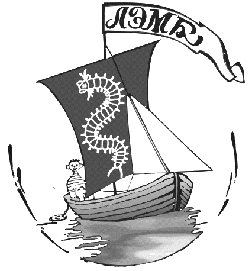

 
```{r setup, include=FALSE}
knitr::opts_chunk$set(echo = FALSE)

library(knitr)
```

<style type="text/css">

body{ /* Normal  */
      font-size: 18px;
  }
td {  /* Table  */
  font-size: 18px;
}
h1.title {
  font-size: 60px;
  color: DarkRed;
}
h1 { /* Header 1 */
  font-size: 30px;
  color: black;
}
h2 { /* Header 2 */
    font-size: 25px;
  color: black;
}
h3 { /* Header 3 */
  font-size: 20px;
  font-family: "Times New Roman", Times, serif;
  color: black;
}
code.r{ /* Code block */
    font-size: 12px;
}
pre { /* Code block - determines code spacing between lines */
    font-size: 14px;
}
</style>





# Регистрация

Уважаемые посетители, для того, чтобы наше взаимодействие прошло с максимальной пользой, вам необходимо зареистрироваться, пройдя по [этой ссылке](https://portal.anichkov.ru/pub/form/42_zapis_na_poznavatelnye_kursy/u0ycd4/). 


# Расписание встреч

```{r}
events <- data.frame(
  Date = c("1 июля", "2 июля", "4 июля"),
  Event = c("Викторина 'Заповедный детектив'. Загадка первая ", "Прогулки по морскому дну. Занятие 1. 'Море как среда обитания'", "Прогулки по морскому дну. Занятие 2. 'Белое море и его особенности' " )
)
```


```{r}
kable(events, col.names = c("Дата", "Мероприятие"))
```


# **Заповедный детектив**

## Загадка первая. "**Странные инструменты**"
+ [Вводное видео]()
+ [Презентация с загадкой]()
+ [Google форма для вашей версии разгадки]()
<!-- + [Видео с разгадкой]() -->


# **Прогулки по морскому дну**

## Прогулка первая. 
+ [Море как среда обитания]()

## Прогулка вторая. 
+ [Физико-географическая и биологическая характеристика Белого моря]()

## Прогулка третья. 
+ [Приливно-отливные явления. Литораль и ее строение]()

## Прогулка четвертая. 
+ [Верхняя литораль]()


## Прогулка пятая. 
+ [Жизнь на илисто-песчаной литорали]()

## Прогулка шестая. 
+ [Жизнь на каменистой литорали]()

## Прогулка седьмая. 
+ [Постоянное непостоянство: сложная жизнь мидиевой банки]()

## Прогулка восьмая. 
+ [Сублитораль и ее обитатели]()


